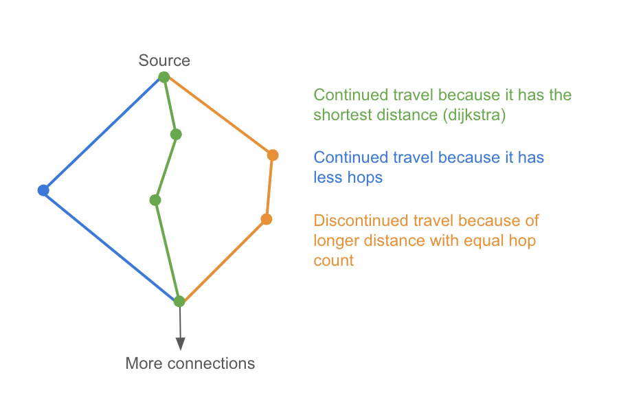

# Shortest flight path finder

In this repository, you will find an [express](https://www.npmjs.com/package/express) service written in [typescript](https://www.npmjs.com/package/typescript). The repository assumes you have configured [Yarn](https://yarnpkg.com) and [Node.js (18+)](https://nodejs.org/en/) on your system.

It has a JSON over HTTP API endpoint that takes as input two IATA/ICAO airport codes and provides as output a route between these two airports so that:

1. The route consists of at most n legs/flights (for example if n=4 then there can be 3 stops/layovers, if going from A->B, a valid route could be A->1->2->3->B, or for example A->1->B etc.) and;
2. The route is the shortest such route as measured in kilometers of geographical distance.

The api endpoint has two optional query parameters:
1. `allowed-hops` - that sets the maximum number of allowed hops (default = 4)
2. `with-ground-hops` - allows to switch airports that are closer than 100km apart via ground

## Explanation of the solution

The solution uses dijkstra minimum distance algorithm and combines it with a "brute force" algorithm that intends to travel all the possible routes in the given hops limit.

Dijkstra is an efficient algorithm that finds the shortest distance to any node from a source node, but it does not work with a hops limit.

"Brute force" algorithm is very slow on its own as the number of potential paths to travel increases quickly as the connections from airports and allowed hops count grow. Combining these two approaches helps to keep it performant and consider hop count limit.

Having dijkstra data available allows continuing a travel if:

-   the limit of allowed hops is not met yet
-   and this is the dijkstra's shortest path or it is possible to get to the current point with fewer hops compared to dijkstra

## Performance measurements

I used HAV-TAY route with different hop limits to measure how fast the solution implementation works and compared it to "brute force" implemenation. All measurements in ms.

| Hops limit | Solution (with ground hops) | Solution (without ground hops) | Brute force (with ground hops) | Brute force (without ground hops)  |
| ---------- | --------------------------- | ------------------------------ | ------------------------------------------- | ------------------------ |
| 3          | 484                         | 264                            | 245                                         | 47                       |
| 4          | 705                         | 289                            | 20127                                       | 487                      |
| 5          | 1547                        | 350                            |                                             | 30500                    |
| 6          | 1834                        | 428                            |                                             |                          |

Dijkstra: 247 (with ground hops), 260 (without ground hops)

## Limitation of the solution

Current implemenation with ground hops doesnt allow the travel to begin with one. Ground hops are allowed in the middle and in the end of the travel but not in the start. It could be implemented by adding the ground connected airports to starting lists of the two algorithms.

