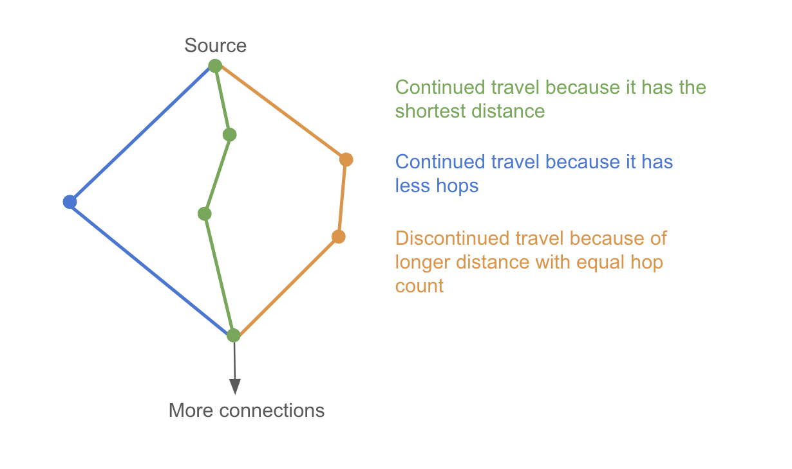

# Shortest flight path finder

In this repository, you will find an [express](https://www.npmjs.com/package/express) service written in [typescript](https://www.npmjs.com/package/typescript). The repository assumes you have configured [Yarn](https://yarnpkg.com) and [Node.js (18+)](https://nodejs.org/en/) on your system.

It has a JSON over HTTP API endpoint that takes as input two IATA/ICAO airport codes and provides as output a route between these two airports so that:

1. The route consists of at most n legs/flights (for example if n=4 then there can be 3 stops/layovers, if going from A->B, a valid route could be A->1->2->3->B, or for example A->1->B etc.) and;
2. The route is the shortest such route as measured in kilometers of geographical distance.

The api endpoint has two optional query parameters:

1. `max-flights-count` - that sets the maximum number of allowed legs/flights (default = 4)
2. `with-ground-hops` - allows to switch airports that are closer than 100km apart via ground
3. `algo` - to set the algorithm that is used (more on that below)

# Explanation of the algorithms

The solution has three different algorithms that use the same underlying principle.

## Working principle

All of these algorithms iterate over `travel`s. `travel` is essentially a list of connections (eg. airport1 -> aiprot2 -> airport3). Representing one potential way how it is possible to travel from the source airport.

A `travel` object has following properties:

-   `hops`: keeps track of the flights that have been taken.
-   `distance`: keeps track of the total distance of all flights combined.
-   `location`: last airport that was visited. Same as the destination of last flight/hop.

The run starts by creating the first travel and pushing it to unfinished travels array. The first travel looks like this:

```
{
    hops: [],
    distance: 0,
    location: <source airport id>
}
```

Also a shortest distances table is crerated by setting source airport destination as 0 and all other airports distances to infinity.

In each cycle one unfinished travel is selected and all connections from the `travel`'s current location are considered as follows:

1. New travel is created by adding the connection to hops and updating distance and location.
2. If the new travel reaches its final location with a smaller distance than is currently known, then the shortest distances table is updated.
3. It is decided if the new travel should be further extended or not (see below). If the travel should be extended it is pushed to unfinished travels array.

Algorithm finishes if there is no more travels to extend

## Conditions for deciding if a `travel` should be extended

The three algorithms (Brute force, Brute force Plus and Brute force dijkstra) differ in the conditions of extending a travel

### Brute force

Only condition for extending a travel is that it must have fewer hops than is the limit. It means that a travel can even go several times back and forth between two neighboring airports. This is of course very unefficient.

### Brute force plus

On top of the previous condition about hops limit it only extends travels that also either have the shorter distance or fewer hops than the current shortest travel to the location.

### Brute force dijkstra

On top of all previous conditions, this algorithm compares the travel to dijkstras shortest distance to the current location (Dijkstra's shortest distance for all airports is calculated once beforehand).

Having dijkstra data available allows continuing a travel if a travel is either the dijkstra's shortest path or it is possible to get to the current point with fewer hops compared to dijkstra.



## Performance measurements

I used HAV-TAY route with different hop limits to compare the performance of the three algorithms. All measurments in ms.

### Brute force

Works relatively well only until hop limit 4 and without ground hops.

| Hops limit | without ground hops | with ground hops |
| ---------- | ------------------- | ---------------- |
| 3          | 90                  | 243              |
| 4          | 528                 | 20700            |
| 5          | 28600               |                  |
| 6          |                     |                  |

### Brute force plus

This is much faster compared to Brute force and solves 4 hop (with ground hops) with around one second. It is faster than Brute force dijkstra on smaller hop limits. This is because the full dijkstra run takes around 250 ms.

| Hops limit | without ground hops | with ground hops |
| ---------- | ------------------- | ---------------- |
| 3          | 49                  | 140              |
| 4          | 113                 | 1160             |
| 5          | 275                 | 9850             |
| 6          | 927                 |                  |


### Brute force dijkstra

While slower in case of smaller hop counts, this algorithm slows donw much less when hop count is increased or routes are added with allowing ground hops.

| Hops limit | without ground hops | with ground hops |
| ---------- | ------------------- | ---------------- |
| 3          | 260                 | 303              |
| 4          | 275                 | 430              |
| 5          | 314                 | 690              |
| 6          | 346                 | 749              |

## Limitation of the solution

Current implemenation with ground hops doesnt allow the travel to begin with one. Ground hops are allowed in the middle and in the end of the travel but not in the start. It could be implemented by adding the ground connected airports to starting lists of the two algorithms.

## Running the solution

### Running API server locally on localhost:3000

yarn && yarn start

### Running API server in Docker

docker-compose up service
